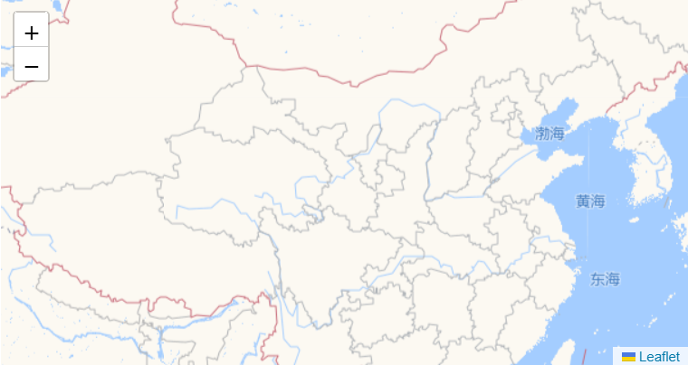
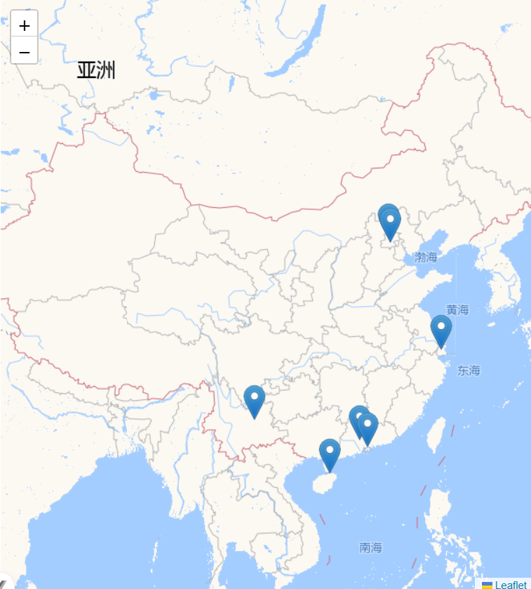

#### 热点图说明文档

***

#### 前言

##### 功能依赖

`MapView` - 基于 Leaflet 的响应式地图组件

#### 安装依赖

```bash
npm install leaflet @types/leaflet
```

#### 组件注册

##### 全局注册 (推荐)
```typescript
// main.ts
import { createApp } from 'vue'
import App from './App.vue'
import MapView from '@/components/MapView.vue'

const app = createApp(App)
app.component('MapView', MapView)
app.mount('#app')
```

##### 局部注册
```vue
<script setup>
import MapView from '@/components/MapView.vue'
</script>
```

#### 组件传参

| 属性名             | 类型                     | 默认值                    | 说明                          |
| ------------------ | ------------------------ | ------------------------- | ----------------------------- |
| `center`           | `LatLngTuple`            | `[35.738861, 104.065735]` | 地图初始中心坐标 [纬度, 经度] |
| `zoom`             | `number`                 | `4`                       | 初始缩放级别 (1-18)           |
| `markers`          | `MapMarker[]`            | `[]`                      | 地图标记点数组                |

#### 类型定义

```typescript
export interface MapMarker {
    lat: number
    lng: number
    name: string
    info: string
}

export interface DistrictOption {
    id: string | number
    name: string
    position: LatLngTuple
    zoom?: number
    markers?: MapMarker[]
}

export interface MarkerClickEvent {
    marker: MapMarker
    originalEvent: L.LeafletEvent
    position: [number, number]
}

export type LatLngTuple = [number, number]

```

#### 事件系统

| 事件名         | 回调参数           | 说明           |
| -------------- | ------------------ | -------------- |
| `marker-click` | `MarkerClickEvent` | 标记点点击事件 |

```typescript
interface MarkerClickEvent {
  marker: MapMarker
  position: LatLngTuple
  originalEvent: L.LeafletEvent
}
```

#### 基础使用示例

```vue
<script setup>
import { ref, computed } from 'vue';
import MapView from '@/components/MapView.vue';

const zoomLevels = {
  '国内': 4,
  '省内': 6,
  '市区': 10
};

const selectedView = ref('国内');
const center = ref([35.738861, 104.065735]);

const markers = ref([
  { lat: 39.914352, lng: 116.404844, name: '北京', info: '首都' },
  { lat: 31.236305, lng: 121.480237, name: '上海', info: '经济中心' },
  { lat: 23.135336, lng: 113.270619, name: '广州', info: '南方大都市' },
  { lat: 20.020000, lng: 110.341000, name: '海南', info: '热带岛屿' },
  { lat: 22.543096, lng: 114.057865, name: '深圳', info: '科技创新中心' },
  { lat: 40.218083, lng: 116.231700, name: '北京昌平区', info: '昌平区位于北京市西北部' },
  { lat: 25.045300, lng: 102.709700, name: '云南', info: '多彩云南，旅游胜地' }
]);

const currentZoom = computed(() => zoomLevels[selectedView.value]);

const handleMarkerClick = (val) => {
  center.value = [val.marker.lat, val.marker.lng]
  selectedView.value = '省内'
}
</script>

<template>
  <div class="about-page">
    <div class="map-controls">
      <select v-model="selectedView" class="view-selector">
        <option v-for="(zoom, name) in zoomLevels" :key="name" :value="name">
          {{ name }}
        </option>
      </select>
    </div>

    <MapView :center="center" :zoom="currentZoom" :markers="markers" class="main-map"
      @marker-click="handleMarkerClick" />
  </div>
</template>

<style scoped>
.about-page {
  position: relative;
  height: 100vh;
  display: flex;
  flex-direction: column;
}

.map-controls {
  padding: 10px;
  background: white;
  z-index: 1000;
}

.view-selector {
  padding: 8px 12px;
  border-radius: 4px;
  border: 1px solid #ddd;
}

.main-map {
  flex: 1;
  height: calc(100% - 50px);
}

@media (max-width: 768px) {
  .view-selector {
    width: 100%;
  }
}
</style>

```

> 效果展示

##### 构成地图信息

通过导入组件 `MapView` 后，呈现组件效果



##### 注入标记地址

通过组件传入的 `markers` 数组数据，提供坐标轴，可在地图上标记区域



##### 自由位置切换

地图可以自由切换大小，并且可以通过标记切换大小和中心点

